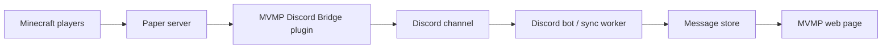

# Architecture

## Components

## Current Foundation

The first version keeps the Minecraft-to-Discord path simple:

- Paper server runs through Docker Compose.
- Paper plugin listens to joins, quits, deaths, chat, and lifecycle events.
- Plugin posts those events to a Discord webhook.
- Discord worker reads the configured channel and writes a public feed JSON file.
- Web app starts as a Vite React application and renders that feed JSON.

## Next Implementation Steps

1. Add Gradle wrapper files or standardize on a local Gradle installation.
2. Store selected channel messages in SQLite or Postgres.
3. Replace the public JSON handoff with an API endpoint backed by the message store.
4. Add server status/RCON integration for player counts and uptime.
5. Add authentication for admin-only controls.
